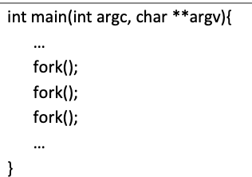
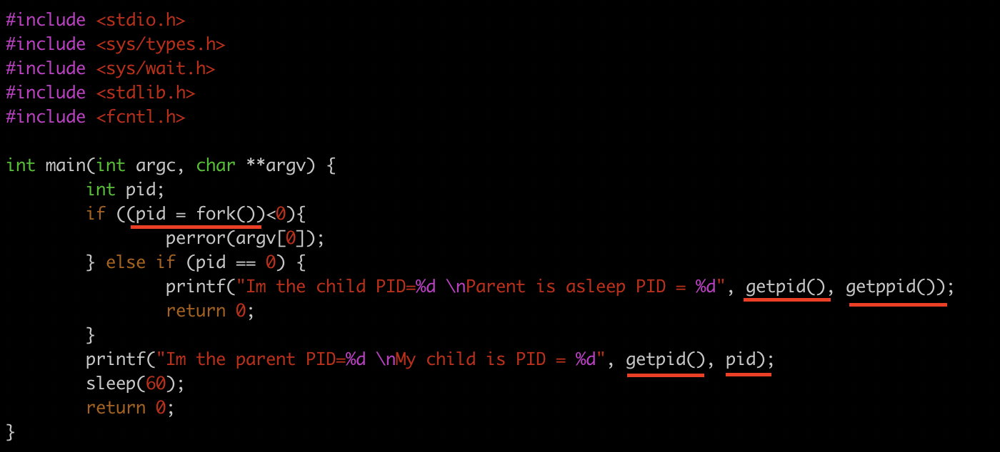

# Labo_III

## fork()

start kind process. copy vh parent process en actieve kind processen.
Maakt dus een exacte kopie van het huidige process.



* 1ste fork maakt kopie van het parent process
* 2de fork maakt kopie van het parent process en het child process
* 3de fork maakt kopie van het parent process en de 2 child processen.

Na een fork voert die het process van parent verder uit omdat die daar al mee bezig is. De childs voert die later uit.

Een manier om de CPU te forceren om het child process verder uit te voeren: Met een sleep(60) word de parent gepauzeerd en word het kind uiteindelijk wel uitgevoerd door de parent.

Met fork is de verwachting dat het programma parellell word uitgevoerd. Kan gecontroleerd worden met:

```bash
date ; ./a.out ; date
```

```bash
strace 2>&1 ./a.out
```

toont brk(0). Het geheugen van a.out word naar nul herleid in het begin
toont execve() process word uitgevoerd. wordt altijd uitgevoerd door een fork.


## c-string array

Een array eindigt op null zodat het programma weet wanneer het moet stoppen. Want het aantal wordt niet meegegeven.

## printf

Worden gebuffered. ALs er veel printfs zijn dan kan het zijn dat er nog steeds printfs worden geprint ook al is er een foutmelding.s

---

## PID

## getpid()

geeft PID van huidig process.

## getppid()

geeft PID van parent.

## child PID

Wordt gereturned door fork(). Moet lokaal worden bijgehouden.

## Orphan process


Kind leeft langer dan ouder.

Child process zonder parent. Het ouder process PID wordt 1.

## zombie process

Deze code maakt een zombie van de parent. De child wilt dood stuurt exit status naar parent maar parent slaapt.



Ouder leeft langer dan kind. En reageert niet op kind.

Parent process zonder child. Kan niet worden vermoord, ook niet met SIGKILL. De parent process leest het process van de child niet. Dus de PID van de child word 1.

Zombie process neemt een plaats in van het process tabel. waardoor er geen plaats meer is voor andere processen.

Is levend en dood tegelijk. Neemt geen CPU-tijd in beslag en ook geen geheugen.

---

## correct werken met meerdere processen.

## waitpid(pid, NULL, 0)

* pid is id van child process
* NULL is status, normaal gezien pointer als ge de status wilt hebben
* 0 ONDERZOEKEN

De parent wacht tot dat de child met gegeven PID is gestopt.

Wait is blocking. Kan ook non-blocking worden gemaakt.

## Enter duwen om uit een output te geraken is geen goed teken!!!!!

Kan zijn dat hij dat express in een oefening steekt.

---

## CMD: ps 

### -ef

Toont process ids en toont wie kind is van wie.

### -aux
Toont de status.

Status:
* S is sleeping.
* R is running.
* T is stopped: zelf aangevraagd om te pauzeren.

## CMD: htop

grafische weergave van processen. Ge kunt ook daarin bepalen welke CPU welk process moet doen.

### Tree (f5 indrukken)

Toont op een grafische manier de relatie tussen parent en child processes.

### Nice (f8 indrukken)

Hoe hoger de Nice waarde hoe minder prioriteit. Met f8 stijgt de Niceness maar daalt de prioriteit.

### Kill

stuurt kill signaal. Er zijn meerdere sig9 en sig15 zijn de meest frequente.

* sig9 of SIGKILL: drastisch vermoordem van process
* sig15 of SIGTERM: ? OPZOEKEN.

## CMD: nice

Command om niceness van process in te stellen. Kan ook een negative waarde krijgen.

## CMD: kill of pkill of killall

* kill: Process ID (PID) nodig
* pkill: Naam van process nodig (default signaal is 15, kan worden gewijzigd)
    * pkill -9 gebruikt signal 9 (SIGKILL)
* killall

## CMD: iotop

toont alle IO van het systeem
